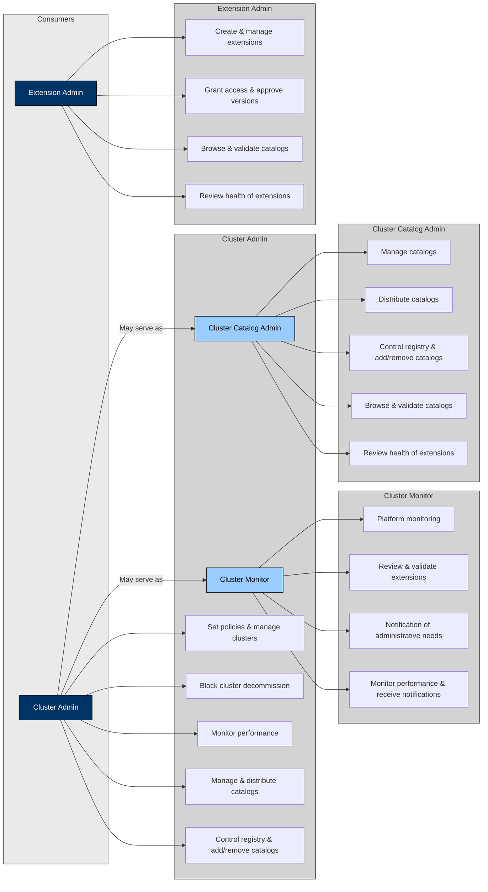
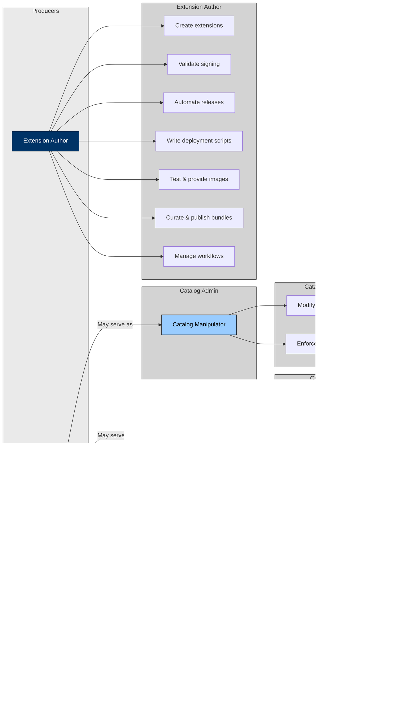

## Personas and Roles in OLM

To map the **personas** and **roles** interacting with **OLM**, the following diagrams were created.

The personas are grouped into:
- **Consumers** – Users who consume or interact with the content which is managed by OLM.
- **Producers** – Users who produces content for OLM which might be the cluster extensions or catalogs.

## Consumers

---

## Producers

